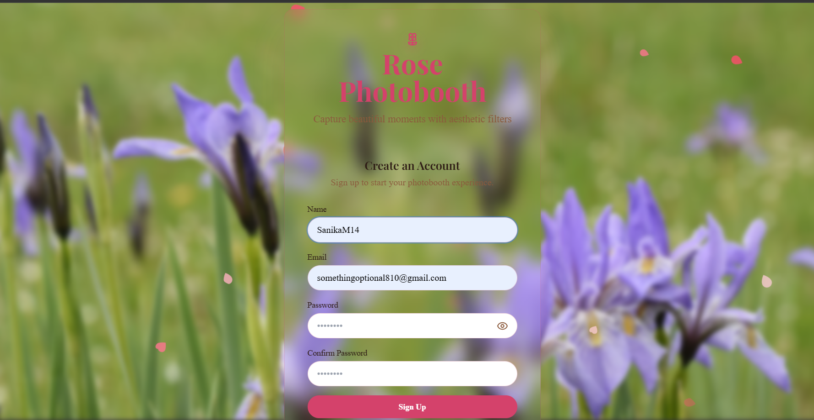
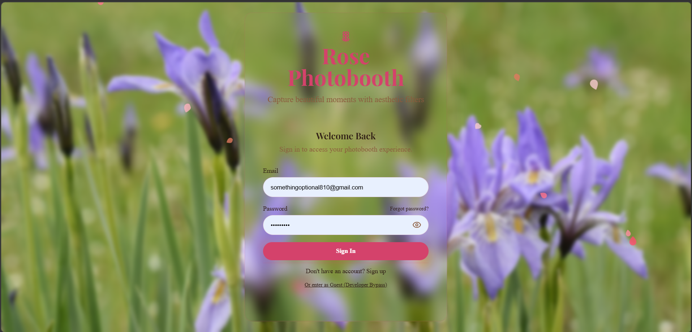
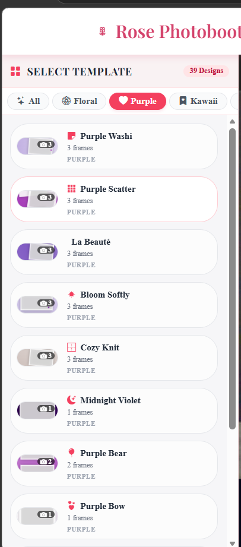
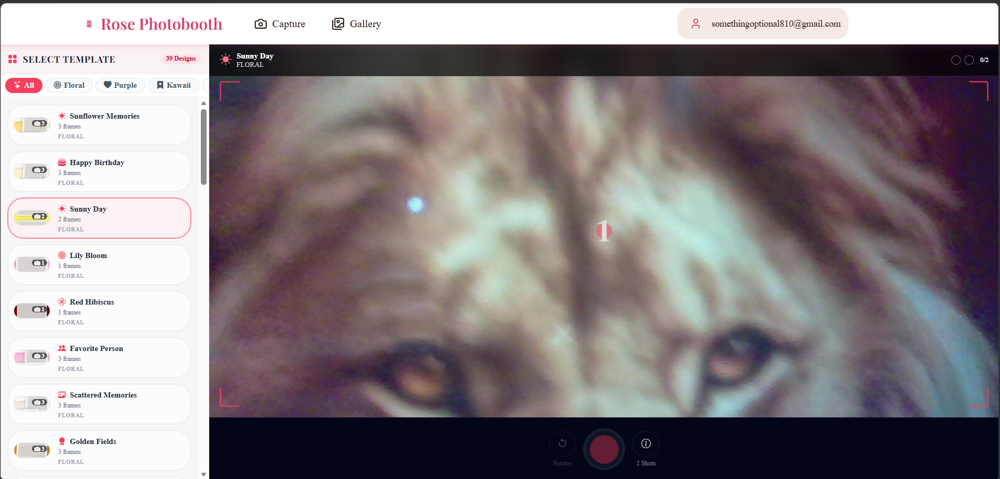
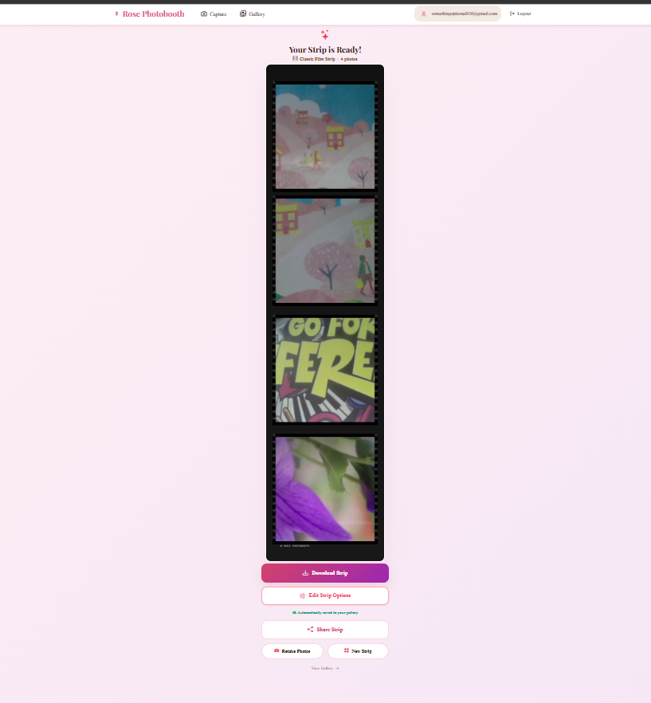
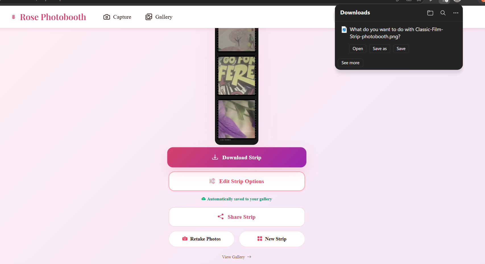
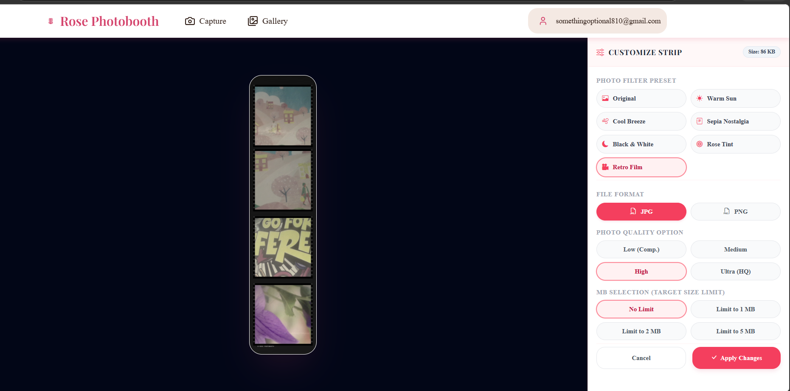
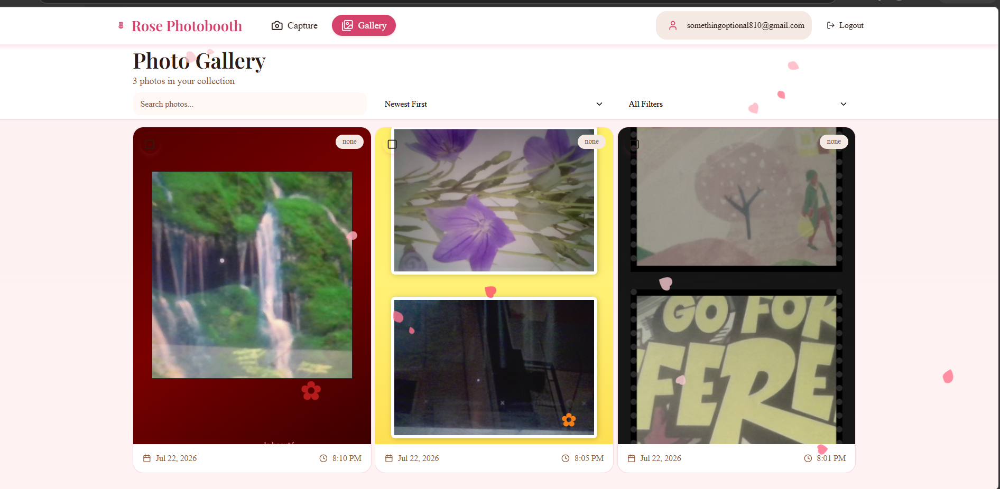
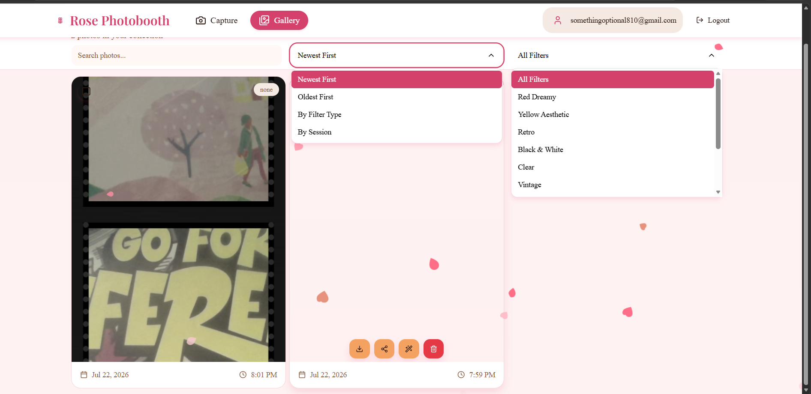
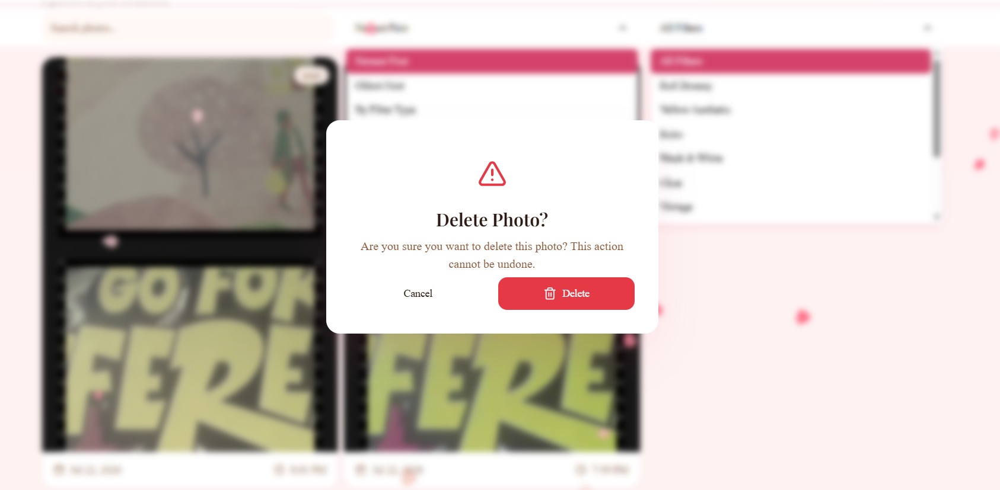

# Rose Photobooth

A modern, responsive web application for capturing and styling photos with aesthetic filters. Built utilizing the latest frontend and backend technologies to provide a seamless user experience.

## Features

- **React 18**: Frontend framework providing improved rendering and concurrent features.
- **Vite**: High-performance build tool and development server.
- **TailwindCSS**: Utility-first CSS framework for comprehensive, responsive styling.
- **React Router v6**: Declarative routing for single-page application navigation.
- **FastAPI**: High-performance Python backend framework for secure API endpoints.
- **Authentication**: Robust email and password authentication with secure session management, built-in rate limiting, and password hashing (bcrypt).
- **Database Integration**: SQLAlchemy ORM with MySQL/SQLite support for reliable data persistence.
- **Docker Support**: Containerized architecture for consistent, isolated deployments across environments.

## Tech Stack

**Frontend:**
- React 18
- Vite
- Tailwind CSS
- React Router v6
- React Hook Form
- Framer Motion

**Backend:**
- Python 3.10+
- FastAPI
- SQLAlchemy
- Passlib & Bcrypt (Password Hashing)
- PyJWT (Authentication)

**Database:**
- MySQL (Production)
- SQLite (Development)

**DevOps & Tooling:**
- Docker & Docker Compose
- ESLint

## Application Walkthrough


Create a secure account to save, manage, and access your captured photo strips across sessions.


Sign in to your existing account to retrieve your personalized gallery and previous captures.


Select from a curated variety of themed photobooth strip templates to personalize your session.


Capture photos using your webcam with an automated countdown timer for precise timing.


View the finalized photo strip composition immediately after your capture session concludes.


Download the high-resolution photo strip directly to your local device for sharing and printing.


Customize your final strip by applying visual filters and adjusting the output file format and size.


Browse your personal collection of captured photo strips within the dedicated user gallery.


Organize your gallery by applying sorting preferences and thematic filters to locate specific captures.


Manage your storage by securely deleting unwanted photo strips from your collection.

## Prerequisites

- Node.js (v18.x or higher)
- npm or yarn
- Python 3.10+
- Docker and Docker Compose (optional, for containerized deployment)

## Installation and Setup

### Docker Deployment (Recommended)

The easiest way to run the full application stack is using Docker Compose.

1. Ensure Docker Desktop is running.
2. Build and start the containers in detached mode:
   ```bash
   docker-compose up --build -d
   ```
3. The frontend will be available at `http://localhost:3000` and the backend API at `http://localhost:8080`.

### Local Development

If you prefer to run the application natively without Docker:

**Backend Setup:**
1. Navigate to the project root directory.
2. Create and activate a Python virtual environment:
   ```bash
   python -m venv backend/venv
   source backend/venv/bin/activate  # On Windows: backend\venv\Scripts\activate
   ```
3. Install the required Python dependencies:
   ```bash
   pip install -r backend/requirements.txt
   ```
4. Start the FastAPI server:
   ```bash
   uvicorn backend.main:app --host 127.0.0.1 --port 8080 --reload
   ```

**Frontend Setup:**
1. Open a new terminal and navigate to the project root directory.
2. Install Node dependencies:
   ```bash
   npm install
   ```
3. Start the Vite development server:
   ```bash
   npm start
   ```

## Project Structure

```
rose-photobooth/
├── backend/              # FastAPI application and Python logic
│   ├── static/           # Stored uploads and media
│   ├── auth.py           # Authentication and security utilities
│   ├── config.py         # Environment configurations
│   ├── database.py       # Database connection handling
│   ├── main.py           # API endpoints and application entry
│   ├── models.py         # SQLAlchemy database models
│   ├── schemas.py        # Pydantic validation schemas
│   └── requirements.txt  # Python dependencies
├── public/               # Static frontend assets
├── src/                  # React source code
│   ├── components/       # Reusable UI components
│   ├── pages/            # View components (Login, Strip Selection, etc.)
│   ├── services/         # API integration services
│   ├── App.js            # Main application router
│   └── index.jsx         # Application entry point
├── docker-compose.yml    # Multi-container orchestration
├── Dockerfile            # Frontend container specification
└── package.json          # Node dependencies and scripts
```

## Styling

This project utilizes Tailwind CSS for styling. The configuration includes tailored typography, responsive utilities, and custom aesthetics aligned with the application's branding. 

## Deployment

To build the application for a production environment, run the following command to generate the optimized frontend bundle:

```bash
npm run build
```

The resulting files will be located in the `dist` directory, ready to be served by Nginx or another static file server.

## Acknowledgments

- Powered by React and Vite
- Styled with Tailwind CSS
- Backend powered by FastAPI

## License

This project is licensed under the MIT License - see the [LICENSE](LICENSE) file for details.
